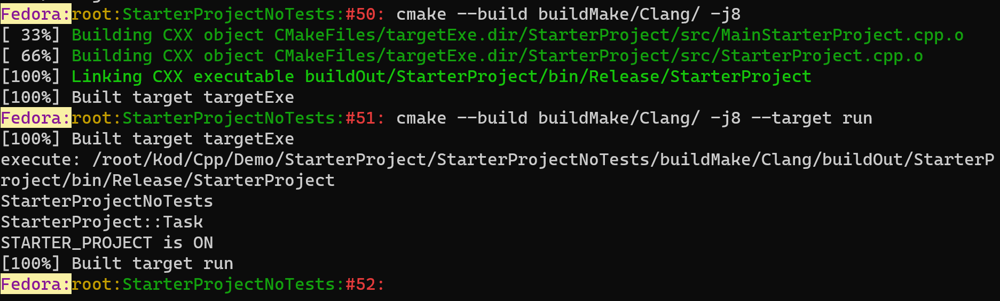

# A simple project (without tests) to get started with (modern) CMake and CMakePresets.json
This is a nearly blank C++ project that is meant to serve as a starting template for cross-platform CMake builds. *More modern* CMake scripting conventions are adhered to and a useful CMakePresets.json is provided which stores various options to avoid typing them at the command prompt during the cmake configure/generate steps. 

For a proper example with unit tests and mocks, please refer to the demo
[CMakeStarterProjectWithTests](https://github.com/MariuszJozef/CMakeStarterProjectWithTests.git).

```
git clone --depth 1 https://github.com/MariuszJozef/CMakeStarterProjectNoTests.git
cd CMakeStarterProjectNoTests
```

The structure of the project is:
```
.
├── CMakeLists.txt
├── CMakePresets.json
├── CMakeUtils
│   ├── Handy
│   │   ├── DisallowInSourceBuilds.cmake
│   │   ├── DisplayGenericInfo.cmake
│   │   └── SelectCompilerViaFlagIfNotUsingCMakePresets.cmake
│   └── Presets
│       ├── BuildType.json
│       ├── Compilers.json
│       ├── Platforms.json
│       └── SingleConfigGenerators.json
├── README.md
└── StarterProject
    ├── hdr
    │   └── StarterProject.hpp
    └── src
        ├── MainStarterProject.cpp
        └── StarterProject.cpp
```
## Some specific examples of CMake commands to configure, build, and run the program *without* CMakePresets.json

(Makefile generator and g++ compiler)
```
cmake -S . -B buildMake/Gnu -G "Unix Makefiles" -D CMAKE_CXX_COMPILER=g++ -D CMAKE_BUILD_TYPE=Debug
cmake --build buildMake/Gnu/ -j8
cmake --build buildMake/Gnu/ -j8 --target run
```
(Makefile generator and clang++ compiler)
```
cmake -S . -B buildMake/Clang -G "Unix Makefiles" -D CMAKE_CXX_COMPILER=clang++ -D CMAKE_BUILD_TYPE=Release
cmake --build buildMake/Clang/ -j8
cmake --build buildMake/Clang/ -j8 --target run
```
(NMake generator and Visual Studio compiler)
- On Windows 11 it is preferable to issue the commands from **"Developer Command Prompt for VS 2022"** instead of regular PowerShell or CMD because the former has predefined Visual Studio environment variables which enable compilation with VS compiler.
- If nevertheless using PowerShell/CMD, or on Windows 10, one must first run some appropriate *.bat scripts that define VS environment variables.
```
cmake -S . -B buildNMake/Msvc -G "NMake Makefiles" -D CMAKE_CXX_COMPILER=cl.exe -D CMAKE_BUILD_TYPE=MinSizeRel
cmake --build buildNMake/Msvc/
cmake --build buildNMake/Msvc/ --target run
```
(Ninja multi-config generator and default compiler)
```
cmake -S . -B buildNinjaMC -G "Ninja Multi-Config"
cmake --build buildNinjaMC/ --config Debug --target run
cmake --build buildNinjaMC/ --config Release --target run
cmake --build buildNinjaMC/ --config RelWithDebInfo --target run
```
All binaries are placed into their own build directory, not intermingled with project sources (an out or source build), and can be easily deleted. Distinct compilers should build into a separate (sub)directory. The first two configure/build command sets above produce the executable into the following build tree:
```
buildMake
├── Clang
│   ├── CMakeCache.txt
│   └── buildOut
│       └── StarterProject
│           ├── bin
│           │   └── Release
│           │       └── StarterProject
│           └── pdb
│               └── Release
└── Gnu
    ├── CMakeCache.txt
    └── buildOut
        └── StarterProject
            └── bin
                └── Debug
                    └── StarterProject_d
```


The fourth build produces three executables (one for each configuration):
```
buildNinjaMC
├── CMakeCache.txt
└── buildOut
    └── StarterProject
        └── bin
               ├── Debug
               │   └── StarterProject_d
               ├── RelWithDebInfo
               │   └── StarterProject
               └── Release
                   └── StarterProject
```
## Some specific examples of CMake commands to configure, build, and run the program *with* CMakePresets.json
The above did not use CMakePresets.json, but it is convenient to use it, e.g. to build with a Visual Studio generator for 64 bit architecture and for all configurations:
```
cmake --preset VSx64-Msvc
cmake --build --preset VSx64-Msvc --config Debug --target run
cmake --build --preset VSx64-Msvc --config Release --target run
cmake --build --preset VSx64-Msvc --config RelWithDebInfo --target run
cmake --build --preset VSx64-Msvc --config MinSizeRel --target run
```
To acheive the same without CMakePresets.json one would need to type:
```
cmake -S . -B buildVS/x64/Msvc -G "Visual Studio 17 2022" -A x64
cmake --build buildVS/x64/Msvc --config Debug -j8 --target run
cmake --build buildVS/x64/Msvc --config Release -j8 --target run
cmake --build buildVS/x64/Msvc --config RelWithDebInfo -j8 --target run
cmake --build buildVS/x64/Msvc --config MinSizeRel -j8 --target run
```
The output build tree in this case looks like:
```
buildVS
└───x64
    └───Msvc
        │   CMakeCache.txt
        │   StarterProjectNoTests.sln
        └───buildOut
            └───StarterProject
                ├───bin
                │   ├───Debug
                │   │       StarterProject_d.exe
                │   │
                │   ├───MinSizeRel
                │   │       StarterProject.exe
                │   │
                │   ├───Release
                │   │       StarterProject.exe
                │   │
                │   └───RelWithDebInfo
                │           StarterProject.exe
                │
                └───pdb
                    ├───Debug
                    │       StarterProject_d.pdb
                    │
                    ├───MinSizeRel
                    ├───Release
                    └───RelWithDebInfo
                            StarterProject.pdb
```
**N.B.**
* The Visual Studio solution which is generated by CMake: ./buildVS/x64/Msvc/StarterProjectNoTests.sln can be opened with Visual Studio (VS) and built/ran from there.
* However this StarterProjectNoTests.sln file is ***transient*** (therefore it resides in a build*/ subdirectory): any modifications made from within VS will be overwritten upon subsequent invocation of CMake generator: `cmake -S . -B buildVS/x64/Msvc -G "Visual Studio 17 2022" -A x64`.

# Generic CMake Commands to Configure, Build, and Run the Program
## *Without* CMakePresets.json: Single-config generators
```
cmake -S <sourceDir> -B <buildDir> -G <generator> -D CMAKE_BUILD_TYPE=<buildType>
cmake --build <buildDir> -j <number of CPU cores>
cmake --build <buildDir> -j <number of CPU cores> --target run
```
N.B.
* `<sourceDir>` is usually the current directory, where topmost CMakeLists.txt resides, since usually `cd <projectDir>`, therefore `<sourceDir> ---> .`
* `<buildDir>` can consist of  subdirectories; this is helpful to ensure that different compilers/architectures get built into a distinct destinations, e.g.
```
<buildDir> ---> buildMake/Gnu
<buildDir> ---> buildNinja/Clang
<buildDir> ---> buildVS/x64/Msvc
```
* Example of single-config generators:
```
<generator> ---> Ninja
<generator> ---> "Unix Makefiles"
<generator> ---> "NMake Makefiles"
```
* Possible build configurations are:
```
<buildType> ---> Debug
<buildType> ---> Release
<buildType> ---> RelWithDebInfo
<buildType> ---> MinSizeRel
```
* Leaving off `-D CMAKE_BUILD_TYPE=<buildType>` results in a debug build

## *Without* CMakePresets.json: Multi-config generators
For multi-config generators the build type is **not** specified *at the configure step* but at the **build step via the "--config" flag**; the possible build types are the same as for single config generators - with the exception that "Ninja Multi-config" does not accept "MinSizeRel" as a build type.
```
cmake -S <sourceDir> -B <buildDir> -G <generator> [ -A <Visual Studio architecture> ]
cmake --build <buildDir> -j <number of CPU cores> --config <buildType>
cmake --build <buildDir> -j <number of CPU cores> --config <buildType> --target run
```
Example of multi-config generators:
```
<generator> ---> "Ninja Multi-Config"
<generator> ---> "Visual Studio 17 2022"
<generator> ---> Xcode
<generator> ---> "Eclipse CDT4 - Unix Makefiles"
```
Architecture should only be specified for Visual Studio:
```
<Visual Studio architecture> ---> win32
<Visual Studio architecture> ---> x64
```
## *With* CMakePresets.json
To see which presets are available (out of those defined in CMakePresets.json) on a given platform run the command:
```
cmake --list-presets all
```
For the CMakePresets.json defined in this project, a part of the output for the above command is (single-config):
```
Make-Clang-Debug
NMake-Msvc-Release
Ninja-Gnu-MinSizeRel
etc.
``` 
(multi-config):
```
NinjaMC-Gnu
VSx64-Msvc
Xcode-Clang
etc.
```
## *With* CMakePresets.json: Single-config generators
```
cd <projectDir>
cmake --preset <presetName>
cmake --build --preset <presetName>
cmake --build --preset <presetName> --target run
```
## *With* CMakePresets.json: Multi-config generators
```
cd <projectDir>
cmake --preset <presetName>
cmake --build --preset <presetName> --config <configType>
cmake --build --preset <presetName> --config <configType> --target run
```
